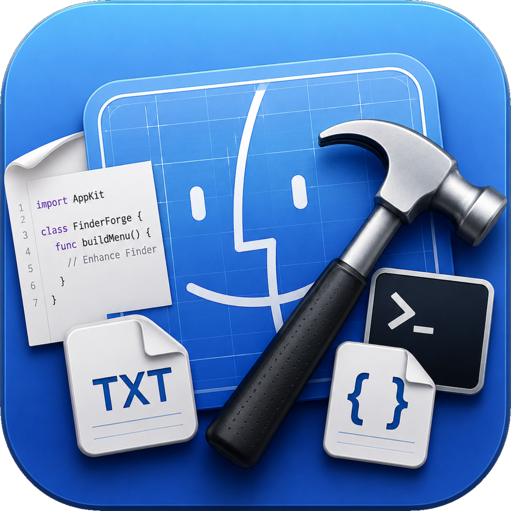
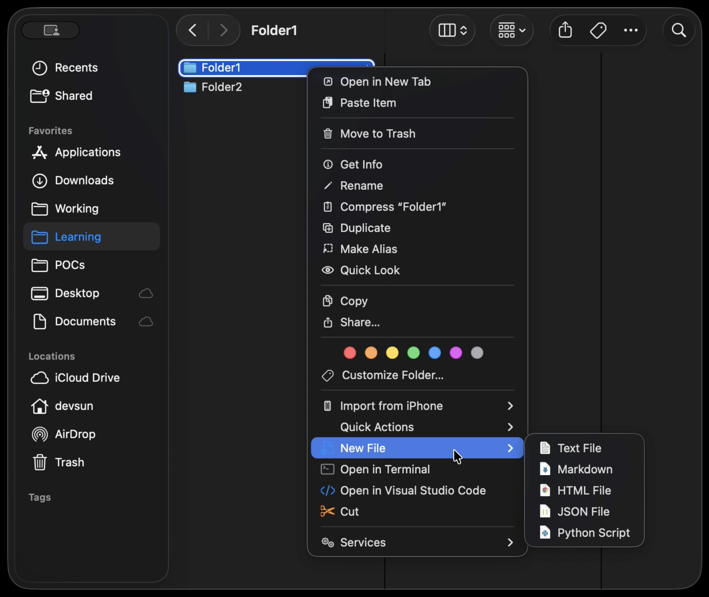

# FinderForge



A small macOS app that puts some genuinely useful things into Finder's right-click menu.

It started as a "New File" menu (the one Windows has and macOS, for some reason, still doesn't) and slowly turned into a handful of things I kept wishing Finder could just do.

*[อ่านภาษาไทย →](README.md)*

<p align="center">
  
</p>

## What it does

**New File** from a set of templates: text, Markdown, HTML, JSON, Python, shell, Swift, RTF. You choose which ones show up, and each can carry its own starter content and default filename. Templates understand a few placeholders too, like `{date}`, `{user}`, `{folder}` and `{uuid}`.

**Cut / Paste (Move)** so you can move files around the way Windows does it, instead of dragging or holding ⌥ while pasting. Cut files get a little scissors badge.

**Open in Terminal** with whatever terminal you actually use, Terminal, iTerm, Warp, Ghostty and so on. Same idea for **Open in Editor** (VS Code, Cursor, Xcode, Zed…). Only the apps you have installed show up in settings.

There's a small settings window and a short intro on first launch, both SwiftUI. The menu itself and all the file work run inside a Finder Sync extension, and the two sides share their settings through an App Group. UI is in English and Thai and just follows your system language.

## Building

You need Xcode 15+ and XcodeGen:

```
brew install xcodegen
xcodegen generate
```

Then run the helper script, which builds, reloads the extension and opens the app:

```
./Scripts/run.sh
```

Or just open `FinderForge.xcodeproj` and press Cmd+R.

The `.xcodeproj` is generated from `project.yml`, so it isn't checked in. Edit `project.yml`, never the project file directly. If you forked this, point `DEVELOPMENT_TEAM` at your own team.

The first time, you have to switch the extension on yourself: System Settings → General → Login Items & Extensions, then find it under Added Extensions (or Finder) and tick FinderForge. Right-click any folder and the menu should be there. If it isn't, `killall Finder` usually sorts it out.

## How it's laid out

```
FinderForge/             the SwiftUI app (settings + onboarding)
FinderMenuExtension/     the Finder Sync extension (menu, file ops)
Shared/                  SharedSettings.swift, used by both
Scripts/                 run.sh and the icon scripts
project.yml              the XcodeGen spec
FinderForgeIcon.png      1024px icon master
```

`SharedSettings.swift` is compiled into both targets and is the only thing they share at runtime, via the App Group.

## A few things worth knowing

Finder hands the menu off across an XPC boundary and drops anything it can't serialize on the way. That's why there are no real separator lines or styled section headers in the menu, and why the menu icons are plain colored bitmaps rather than SF Symbols (template symbols come out solid black on the other side). Spent a while learning that one.

A Finder extension also can't claim ⌘X / ⌘V globally, so Cut and Paste only live in the right-click menu, not the keyboard.

## Changing the icon

Replace `FinderForgeIcon.png` and run:

```
./Scripts/make_app_icon.sh
```

It trims the transparent padding, scales the art to fill the tile and writes out every size. Pass a number (e.g. `./Scripts/make_app_icon.sh 1000`) if you want it tighter or looser.

## Adding a language

Strings live in `en.lproj/` and `th.lproj/` under each target, and the English text in the code is the lookup key. To add another language, drop a `<lang>.lproj/Localizable.strings` into both targets with the same keys and run `xcodegen generate`.

## Still on the list

Copy Path, New Folder from a selection, import/export templates, zip compression, templates that react to `.git`, iCloud sync.

## License

GPLv3, full text in [LICENSE](LICENSE). Fork away, just keep it open.

© 2026 thappatan chanphen
